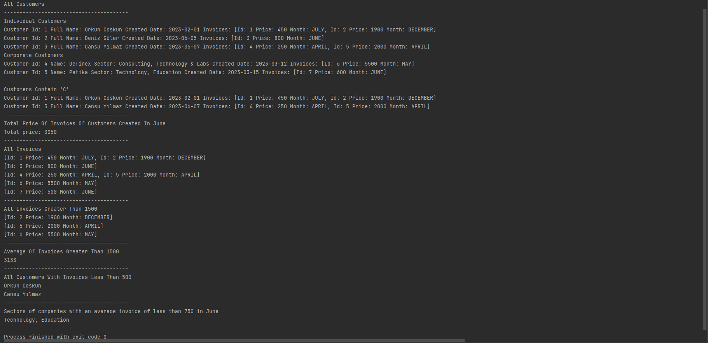

# Order Application HomeWork

# Homework Steps
- Listing operations should be done using stream.

- Create a Maven project.

- Run maven commands and add the output

- List all customers

- Able to create new customers

- List customers with the letter 'C' in them

- List the total amount of invoices of customers who registered in June

- List all invoices in the system

- List the invoices over 1500TL in the system

- Calculate the average of invoices over 1500TL in the system

- List the names of customers with invoices under 500TL in the system

- Write the code that lists the companies in which the average invoices for the month of June are below 750.

# Output

